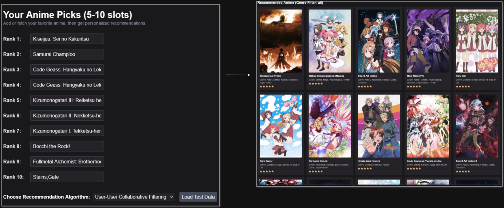
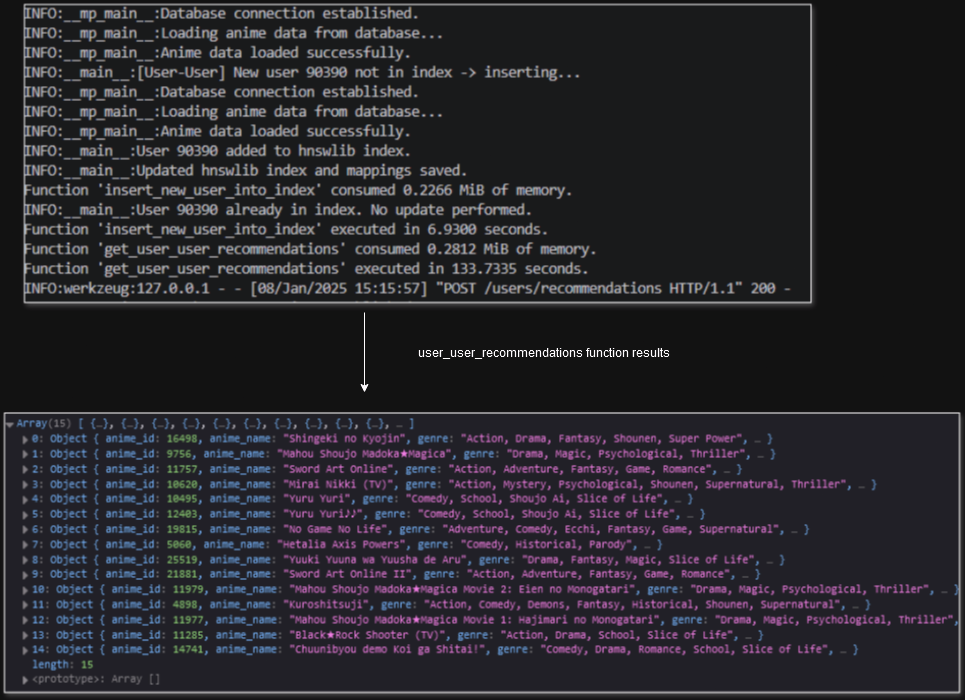
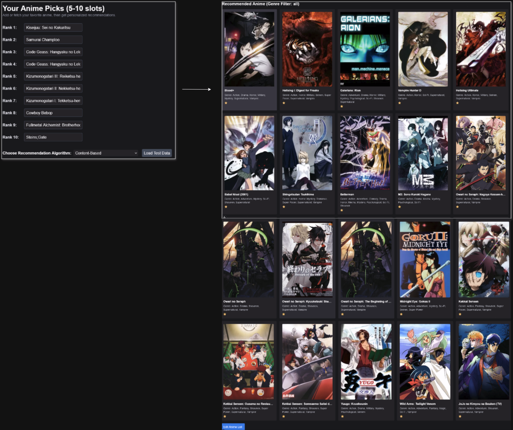
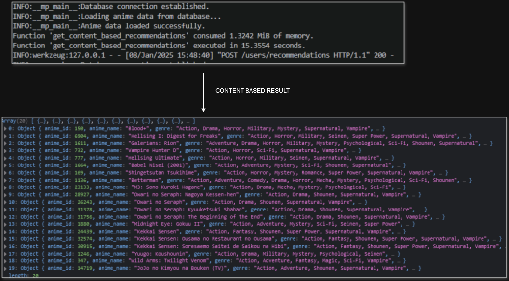
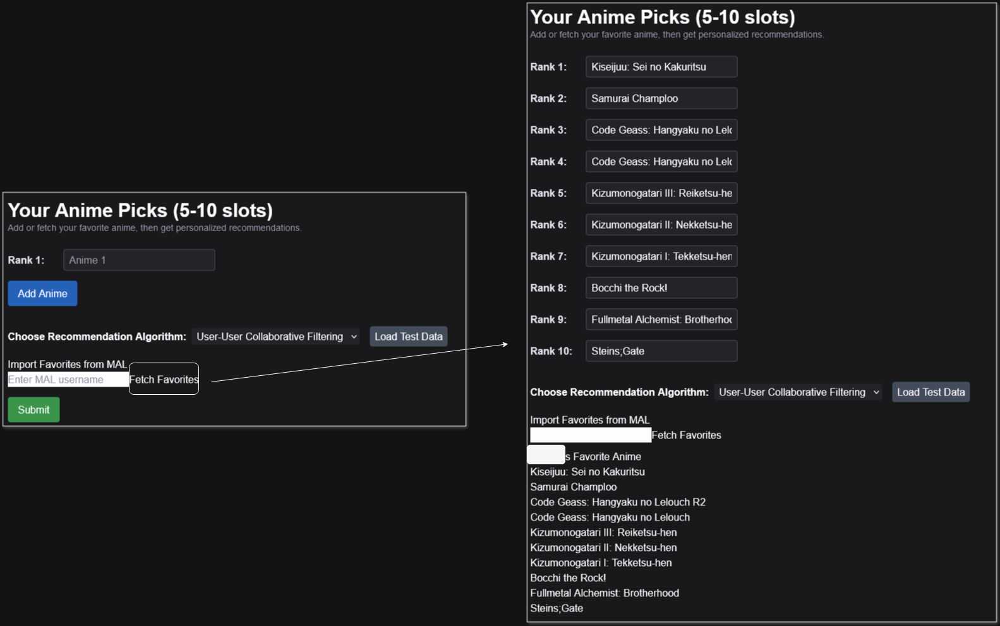
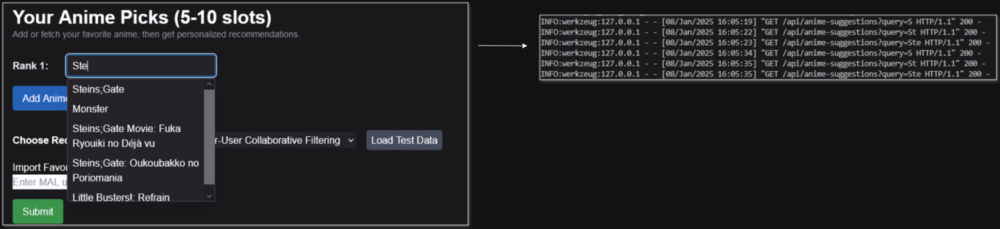

### Frontend Deployed

https://anime-rec-db-frontend.vercel.app/users/anime

#### Frontend User-User

## Backend

### Frontend Contend Based

## Backend

## Other Frontend-tools

### Fetch favorites from MAL

### Suggestions

# Anime Recommendation System: Key Takeaways

## Technical Skills Developed

### **Backend Development**

- Designed and implemented a scalable backend using **Flask** to handle API requests efficiently.
- Integrated **Flask-CORS** to enable cross-origin requests, ensuring compatibility with frontend applications.

### **Database Management**

- Utilized **SQLAlchemy** for efficient ORM operations, connection pooling, and advanced SQL queries.

### **Efficient Data Structures**

- Learned to use **sparse matrices** for memory-efficient representation of user-anime rating data.
- Built a **Hierarchical Navigable Small World (HNSW)** graph for approximate nearest neighbor search with **hnswlib**.

### **Optimization and Profiling**

- Implemented custom decorators for **memory profiling** and **execution time analysis**, optimizing bottlenecks in data processing.
- Improved overall system performance for handling large datasets.

---

## Algorithmic Knowledge Gained

### **Hierarchical Navigable Small World (HNSW)**

- Applied this graph-based algorithm for efficient similarity search, enabling quick identification of similar users.

### **Collaborative Filtering**

- Built a user-user recommendation system to suggest anime based on the preferences of similar users.
- Addressed challenges like data sparsity in real-world datasets.

### **Content-Based Recommendations**

- Used **TF-IDF Vectorization** to transform anime genres into numerical vectors.
- Calculated **cosine similarity** to recommend anime with similar genres.

### **Fuzzy String Matching**

- Employed **thefuzz** (formerly fuzzywuzzy) to match anime names, enhancing user input flexibility for searches.

### **SQL-Based Aggregations**

- Designed SQL queries to aggregate popularity metrics such as average ratings and total rating counts for anime.

---

## Deployment and Scalability Skills

### **Scalability Techniques**

- Built and managed a **hnswlib ANN index**, enabling fast approximate nearest neighbor search and scaling to large datasets of users and anime.

### **Deployment Challenges**

- Encountered memory usage limits when attempting to deploy the backend on **Render**.
- The resource-intensive algorithms, such as building the sparse matrix and hnswlib index, require significant memory, which exceeded the allocation provided by Render's free tier.
- As a result, the backend could not be fully deployed online.
- **Mitigation**: Showcased the backend's functionality through locally generated results and images demonstrating successful recommendation outputs.

---

### **Problem-Solving with Algorithms**

- Developed a deeper understanding of recommendation algorithms and their application in real-world scenarios.
- Balanced accuracy and performance using approximation techniques for scalable recommendations.

### **Performance Optimization**

- Analyzed and optimized memory and computational efficiency for large-scale applications.

### **API Design**

- Designed and implemented RESTful APIs with clear separation of concerns for data retrieval, recommendation logic, and user updates.

## Key Outcomes

- Built a **hybrid recommendation system** combining collaborative filtering and content-based approaches, demonstrating expertise in data science and backend engineering.
- Integrated and applied **algorithms, data structures, and cloud-based tools** to solve real-world problems.
- Gained confidence in designing, profiling, and scaling backend systems for high-performance applications.

---

